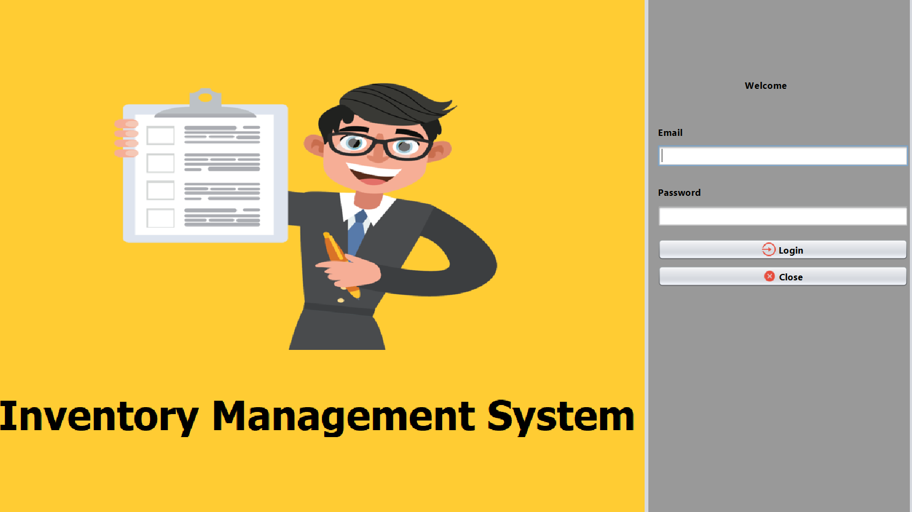
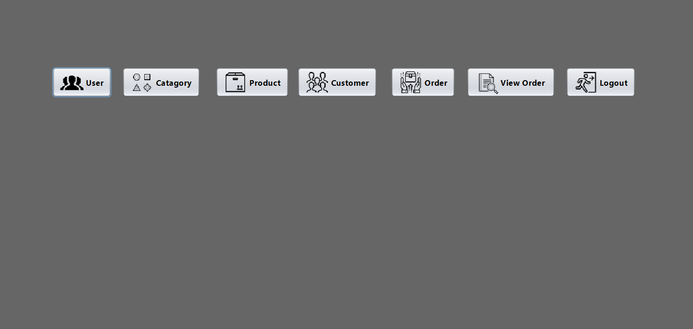
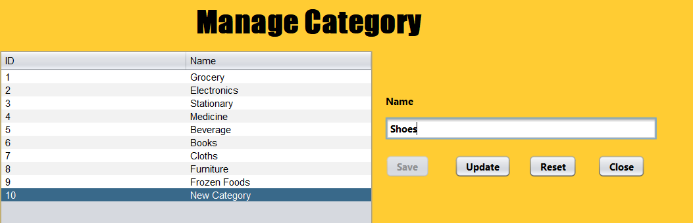
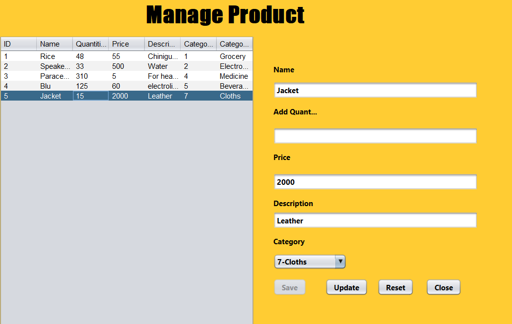
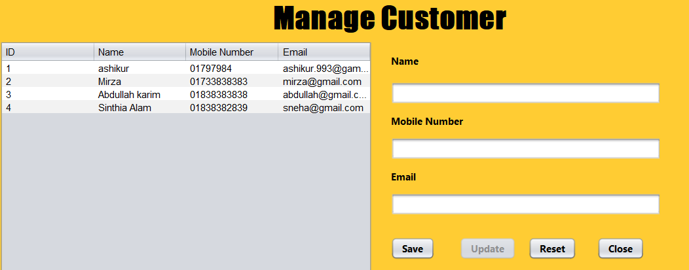
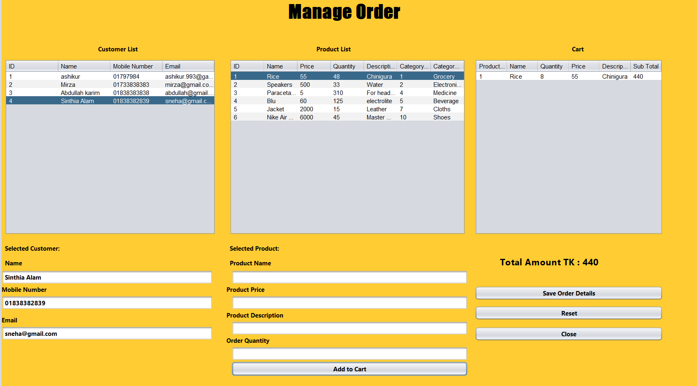
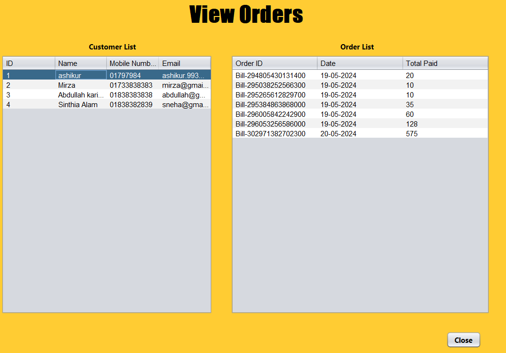
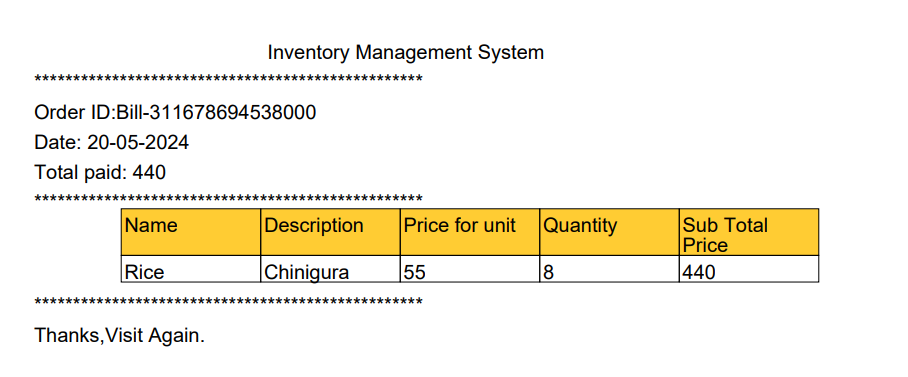
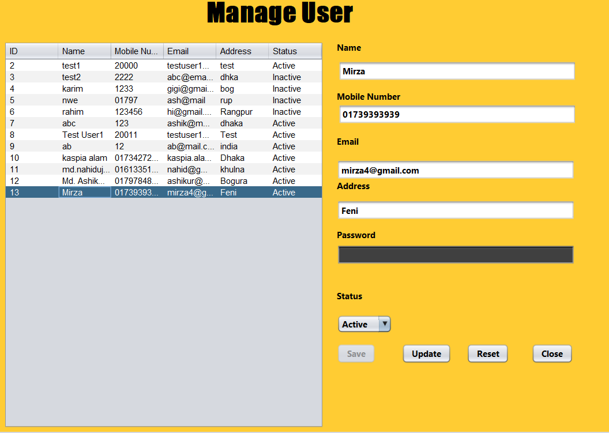

# Inventory Management System  

## Table of Contents  
1. [Overview](#overview)  
2. [Features](#features)  
3. [Class Structure](#class-structure)  
4. [Technical Details](#technical-details)  
5. [Motivation](#motivation)  
6. [How to Run the Project](#how-to-run-the-project)  
7. [Simulation](#simulation)  
8. [Future Enhancements](#future-enhancements)  
9. [Acknowledgements](#acknowledgements)  
10. [Contributors](#contributors)  

---

## Overview  
The **Inventory Management System (IMS)** is a Java-based application designed to streamline and optimize inventory tracking, order management, and stock control. This project was developed as part of an academic requirement for the **BSc in Computer Science and Engineering** program at **Bangladesh University of Business and Technology (BUBT)**.  

The IMS features a user-friendly interface, secure authentication, and seamless management of inventory, customers, and orders, making it ideal for businesses seeking to enhance efficiency and reduce operational costs.  

---

## Features  

1. **Login**  
   - Secure employee authentication using username and password.  

2. **Home Page**  
   - Central hub for accessing all system functionalities, such as managing users, categories, products, orders, and viewing past transactions.  

3. **Manage User**  
   - Super admins can add, update, or manage employee information, including roles and credentials.  

4. **Manage Category**  
   - Allows the creation and modification of product categories for better organization.  

5. **Manage Product**  
   - Enables employees to add and update product details, including name, price, quantity, and category.  

6. **Manage Customer**  
   - Provides tools to handle customer records efficiently by adding or updating customer information.  

7. **Manage Order**  
   - Employees can create orders by selecting products and customers.  
   - Includes a dynamic cart system to manage items and compute total amounts.  

8. **Create Receipt**  
   - Generates detailed receipts in PDF format with order summaries, pricing, and customer details.  

9. **View Orders**  
   - Displays previous orders with detailed information about order IDs, dates, and total spendings.  

---

## Class Structure  

The application consists of the following Java classes, each responsible for a specific functionality:  

- **Home.java**: Acts as the main dashboard providing navigation to other modules.  
- **Login.java**: Handles secure authentication for users.  
- **ManageCategory.java**: Manages product categories.  
- **ManageCustomer.java**: Handles customer data.  
- **ManageOrder.java**: Processes customer orders and maintains order details.  
- **ManageProduct.java**: Manages product inventory and details.  
- **ManageUser.java**: Administers employee data and permissions.  
- **ViewOrders.java**: Displays order history and detailed records.  

---

## Technical Details  

- **Programming Language**: Java  
- **Development Tools**:  
  - IDE: Eclipse  
  - Database: MySQL for backend storage  
  - Libraries: Standard Java libraries  
- **System Design**:  
  - The system follows an object-oriented approach with clearly defined entities and relationships.  
  - Features an ER diagram and flowcharts for conceptual clarity.  

---

## Motivation  

The project was motivated by the need to address challenges in inventory management, such as:  
- Inefficient stock tracking.  
- Delayed order processing.  
- Manual errors in maintaining customer and product information.  

Our goal was to provide businesses with a comprehensive, reliable, and scalable solution to overcome these challenges.  

---

## How to Run the Project  

1. Clone the repository from [GitHub](https://github.com/ashikur498/Invenory_Management_System.git).  
2. Set up the database by importing the provided SQL schema.  
3. Configure database connection details in the project files.  
4. Open the project in an IDE (e.g., Eclipse/netbeans).  
5. Compile and run the application.  

---

## Simulation  

Below is a step-by-step simulation of the **Inventory Management System (IMS)** in action, demonstrating the functionality of each module. Screenshots are included to provide a visual guide.  

### 1. **Login Screen**  
The application begins with a secure login screen where users can authenticate themselves by entering their credentials.  
  

---

### 2. **Home Page**  
After successful login, the user is redirected to the **Home Page**, which acts as a dashboard for accessing all the core features of the system.  
  

---

### 3. **Manage Categories**  
The **Manage Categories** feature allows users to add, edit, or remove product categories for better organization.  
#### Actions:  
- Add a new category by entering its name.  
- Edit or delete existing categories with ease.  

  

---

### 4. **Manage Products**  
Users can add, update, or delete product information in the **Manage Products** module.  
#### Actions:  
- Input product name, category, price, and quantity.  
- Update stock levels.  
- Remove obsolete products.  

  

---

### 5. **Manage Customers**  
This module provides tools to manage customer information, including their name, contact details, and address.  
#### Actions:  
- Add new customers.  
- Edit customer details.  
- Delete unnecessary records.  

  

---

### 6. **Create Order**  
The **Create Order** feature allows employees to:  
- Select products to add to a cart.  
- Assign the order to a specific customer.  
- Automatically calculate the total price.  

Once the order is finalized, a receipt is generated.  

  

---

### 7. **View Orders**  
The **View Orders** module displays a comprehensive list of all previous transactions. Each entry includes:  
- Order ID  
- Customer name  
- Order date  
- Total amount  

  

---

### 8. **Generate Receipt**  
After creating an order, the system automatically generates a detailed receipt in PDF format, which includes:  
- Order summary  
- Customer details  
- Product details (name, quantity, price)  
- Grand total  

  

---

### 9. **Manage Users**  
The **Manage Users** module enables admins to add, edit, or remove employees who can access the system. Roles and permissions are also managed here.  
#### Actions:  
- Add new users.  
- Update user roles (e.g., Admin, Employee).  
- Remove users who no longer need access.  

  

---

### 10. **System Exit**  
The user can log out or exit the system securely via the home screen.  
 

---

## Future Enhancements  

The system can be enhanced by:  
- Integrating with external systems (e.g., accounting software).  
- Implementing advanced algorithms for demand forecasting.  
- Adding support for multi-language interfaces.  

## Acknowledgements  

We would like to thank:  
- **Our Supervisor** ***Labiba Farah***, Lecturer, Department of CSE ,BUBT For her guidance and support throughout the project.  
- **Bangladesh University of Business and Technology**: For providing the platform and resources to develop this project.  

---

## Contributors  

- **Md. Ashikur Rahman**
- **Tasmiah Binte Azad**
- **Ayesha Siddika Esha**
- **MD. Nahidujaman**

